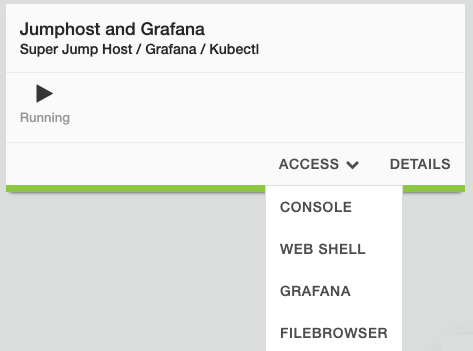

Lab 2 - Deploy Containers on vK8s and Build Grafana Dashboard
=============================================================

**Steps**

Environment Setup:

- Ensure that the NAMESPACE and KUBECONFIG environment variables are set
- Review the Load Balancer and Origin Server Configuration.
- Deploy Grafana using docker compose which will be proconfigured to match your namespace name for each of the 3 regions.

#. Returning back to the Lab Components view, click the jumpbox and then click the *Access* button. From the access list, select **Web Shell**.

From Web Shell, modify and run the following commands to set the NAMESPACE environment variable:

.. note:: This step is key key to ensure the subsequent commands are configured correctly. Environment variables will need to be set each time you launch a new Web Shell.

.. code-block:: bash

  ### Replace <namespace> your own namespace value
  export NAMESPACE=<namespace>

Next, we'll configure you environment to access the vK8s cluster using the kubeconfig file that you downloaded in the previous lab.

.. code-block:: bash

  export KUBECONFIG=/srv/filebrowser/ves_$NAMESPACE\_$NAMESPACE-vk8s.yaml

  #Let's review again to confirm that we can reach the cluster:
  kubectl config view

Now we can deploy the containers into the vK8s cluster.

**Deploy Manifests**

.. code-block:: bash

  cd ~/caaslab
  kubectl apply -f vk8s/

**Review Load Balancer and Origin Server Configuration**

**Deploy Grafana**

.. code-block:: bash

  cd ~/caaslab/docker-grafana
  docker compose up -d

**Access Grafana**

Within the lab components screen, select Access on the Jumphost, and choose Grafana from the dropdown.

Launch Grafana and logon with the username *admin*, and the password *grafana*

Once logged in, navigate to **Dashboards** --> **Services** --> **Distributed Host Stats via MQTT**

On the Dashboard, you should see one chart for each Customer Edge region we deployed to. We haven't sent any data yet, so the charts will be empty.

Note: The Green icons in the image will be an indicator that the connection to the MQTT broker was successful.

.. image:: ../images/grafana-dashboard-empty.png
   :width: 650pt

**Let's Publish Some Data**

Now that we have the Grafana dashboard setup, we can start publishing data to the MQTT brokers.

From the Web Shell, run the following command to start the data publisher:

.. code-block:: bash

  cd ~/caaslab
  ./systemstats2mqtt.sh

The script will start publishing data to the MQTT brokers in each region. After a few minutes, you should start to see data on the Grafana dashboard.

In a couple minutes your Web Shell will look like this:

.. image:: ../images/systemstats2mqtt.png
   :width: 650pt

**Review the Data**

Navigate back to the Grafana dashboard and you should see data populating the charts. If you wait 5 minutes, your dashboard will look something like this:

.. image:: ../images/grafana-dashboard-populated.png
   :width: 650pt

**Conclusion**
