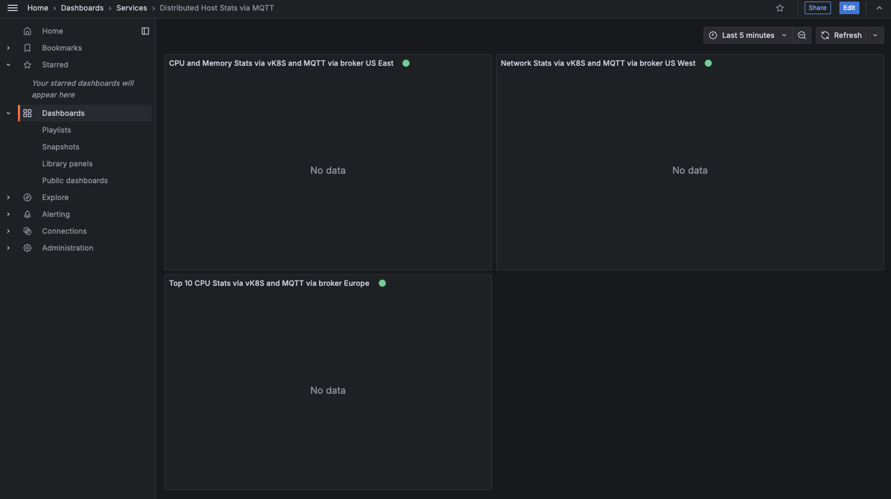
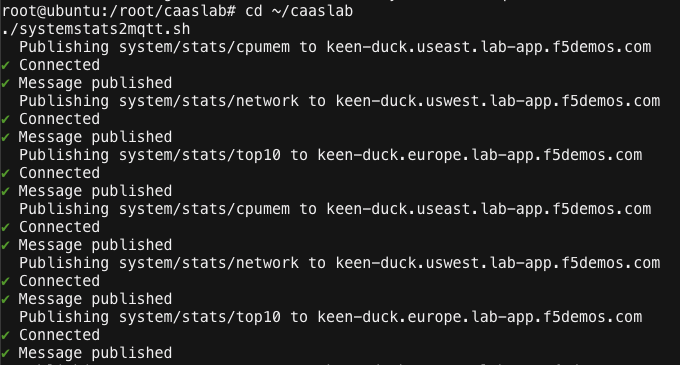
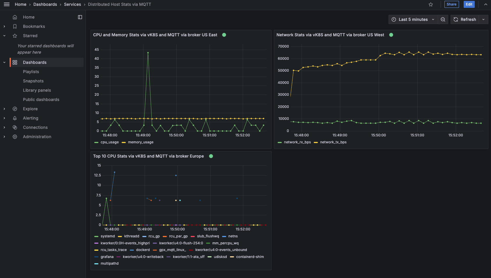

Lab 2 - Deploy Containers on vK8s and Build Grafana Dashboard
=============================================================

**Exercise 1 - Setup Jumphost to connect to the vk8 cluster**

Environment Setup:

- Ensure that the NAMESPACE and KUBECONFIG environment variables are set
- Review the Load Balancer and Origin Server Configuration.
- Deploy Grafana using docker compose which will be proconfigured to match your namespace name for each of the 3 regions.

#. Returning back to the Lab Components view, click the jumphost and then click the *Access* button. From the access list, select **Web Shell**.

   .. image:: ../images/M4-L2-webshell-launch.png
      :width: 400pt

#. From Web Shell, run the following commands:

   a. to view the current kubeconfig of the jumphost.

      .. code-block:: bash

         kubectl config view
            ## output shows kubeconfig is not configured for any cluster.
         apiVersion: v1
         clusters: null
         contexts: null
         current-context: ""
         kind: Config
         preferences: {}
         users: null

   b. to verify that your file is uploaded. 

      .. code-block:: bash

        ls /srv/filebrowser/
            ### Your kubeconfig file you uploaded should be listed here.     
        ves_kind-python_asmith-vk8.yaml

   In the example above, the **NAMESPACE** is **kind-python** and the **Virtual K8s** is **asmith-vk8**.

#. **MAY NOT NEED THIS STEP** 
   From Web Shell, modify and run the following commands to set the NAMESPACE environment variable:

   .. note:: This step is key to ensure the subsequent commands are configured correctly. Environment variables will need to be set each time you launch a new Web Shell.

   .. code-block:: bash

     ### Replace <namespace> your own namespace value
     export NAMESPACE=<namespace>

#. Next, we'll configure you environment to access the vK8s cluster using the kubeconfig file we uploaded to the Jumphost.

   .. code-block:: bash

    ### PREVIOUS COMMAND export KUBECONFIG=/srv/filebrowser/ves_<YOUR NAMESPACE>\_$NAMESPACE-vk8s.yaml
    ### Point the KUBECONFIG to the file we found in Step 2b
    export KUBECONFIG=/srv/filebrowser/ves_kind-python_asmith-vk8.yaml   

    # Let's review again to confirm that we can reach the cluster:
    kubectl config view

   The output should look like this:

   .. image:: ../images/M4-L2-exp-kubeconfig.png
      :width: 400pt

**Exercise 2 - Deploy Containers on vK8s and Add Origin Pool and Load Balancer**

**Deploy Containers on vK8s**

#. Now we can deploy the containers into the vK8s cluster.
   Do this by using the kubectl command to apply the manifest files in the vk8s directory.

   .. code-block:: bash

     cd ~/caaslab
     kubectl apply -f vk8s/

#. Return to the Distributed Cloud console and in the **Distributed Apps** workspace select **Virtual K8s** under **Applications**.

   Click on your vk8 cluster to view the details.

#. Review all the tabs on your Virtual K8s; **Workloads, Deployments, ... Pods.**

   Which ones have something configured?

   Why isn't there a Workload configured for these Pods?

**Origin Pool Configuration**

The Origin Pool will point to the pods on on the vk8s cluster. 

#. On the Distributed Cloud console and in the **Distributed Apps** workspace, under **Manage**, hover over **Load Balancers**, then click **Origin Pools**

#. Click the **Add Origin Pool** button.

#. On the configuration page, click the JSON button.

#. In the textual config editor page select the other JSON button, and then select YAML.

#. Click into the main editor window and then press CTRL-A to select all of the prepopulated text.

   Press the DELETE key (or the BACKSPACE key) to remove all the text.

   There should only be left a blank line on line 1.

#. Copy and paste the following YAML configuration into the editor window:

   .. code-block:: yaml

      metadata:
         name: kind-python-mosquitto
         namespace: kind-python  ## Replace with your namespace
         labels: {}
         annotations: {}
         disable: false
      spec:
      origin_servers:
         - k8s_service:
            service_name: mosquitto.kind-python  ## Replace with your namespace
            site_locator:
               virtual_site:
                  tenant: f5-xc-lab-app-jqguisgi
                  namespace: shared
                  name: appworld2025-k8s-vsite
                  kind: virtual_site
            vk8s_networks: {}
            labels: {}
      no_tls: {}
      port: 1883
      same_as_endpoint_port: {}
      healthcheck: []
      loadbalancer_algorithm: LB_OVERRIDE
      endpoint_selection: LOCAL_ONLY

**TCP Load Balancer Configuration**

The TCP Load Balancer will point to the Origin Pool, which will allow interest access into the MATT containers.

#. On the Distributed Cloud console and in the **Distributed Apps** workspace, under **Manage**, hover over **Load Balancers**, then click **TCP Load Balancers**

#. Click the **Add TCP Load Balancer** button.

#. On the New TCP Load Balancer configuration page, click the JSON button and select YAML as before.

#. Clear any configuration in the editor window as before.

#. Copy and paste the following YAML configuration into the editor window and replace the fields with your namespace.

   .. code-block:: yaml

      metadata:
        name: kind-python-mqtt ## Replace with your namespace
        namespace: kind-python ## Replace with your namespace
        labels: {}
        annotations: {}
        disable: false
      spec:
        domains:
          - kind-python.useast.lab-app.f5demos.com ## Replace with your namespace
          - kind-python.europe.lab-app.f5demos.com ## Replace with your namespace
          - kind-python.uswest.lab-app.f5demos.com ## Replace with your namespace
        listen_port: 8883
        sni: {}
        dns_volterra_managed: false
        origin_pools: []
        origin_pools_weights:
          - pool:
              tenant: f5-xc-lab-app-jqguisgi
              namespace: kind-python      ## Replace with your namespace
              name: kind-python-mosquitto  ## Replace with Origin Pool name
              kind: origin_pool
            weight: 1
            priority: 1
            endpoint_subsets: {}
        advertise_custom:
          advertise_where:
            - virtual_site:
                network: SITE_NETWORK_INSIDE_AND_OUTSIDE
                virtual_site:
                  tenant: f5-xc-lab-app-jqguisgi
                  namespace: shared
                  name: appworld2025-k8s-vsite
                  kind: virtual_site
              use_default_port: {}
      hash_policy_choice_round_robin: {}
      idle_timeout: 3600000
      retract_cluster: {}
      tls_tcp:
        tls_cert_params:
          tls_config:
            medium_security: {}
          certificates:
            - tenant: f5-xc-lab-app-jqguisgi
                namespace: shared
                name: caas-lab-certificate
                kind: certificate
          no_mtls: {}
      service_policies_from_namespace: {}

**Deploy Grafana**

.. code-block:: bash

  cd ~/caaslab/docker-grafana
  docker compose up -d

**Access Grafana**

Within the lab components screen, select Access on the Jumphost, and choose Grafana from the dropdown.

Launch Grafana and logon with the username *admin*, and the password *grafana*

Once logged in, navigate to **Dashboards** --> **Services** --> **Distributed Host Stats via MQTT**

On the Dashboard, you should see one chart for each Customer Edge region we deployed to. We haven't sent any data yet, so the charts will be empty.

Note: The Green icons in the image will be an indicator that the connection to the MQTT broker was successful.

**Let's Publish Some Data**

Now that we have the Grafana dashboard setup, we can start publishing data to the MQTT brokers.

From the Web Shell, run the following command to start the data publisher:

.. code-block:: bash

  cd ~/caaslab
  ./systemstats2mqtt.sh

The script will start publishing data to the MQTT brokers in each region. After a few minutes, you should start to see data on the Grafana dashboard.

In a couple minutes your Web Shell will look like this:

**Review the Data**

Navigate back to the Grafana dashboard and you should see data populating the charts. If you wait 5 minutes, your dashboard will look something like this:

**Conclusion**
